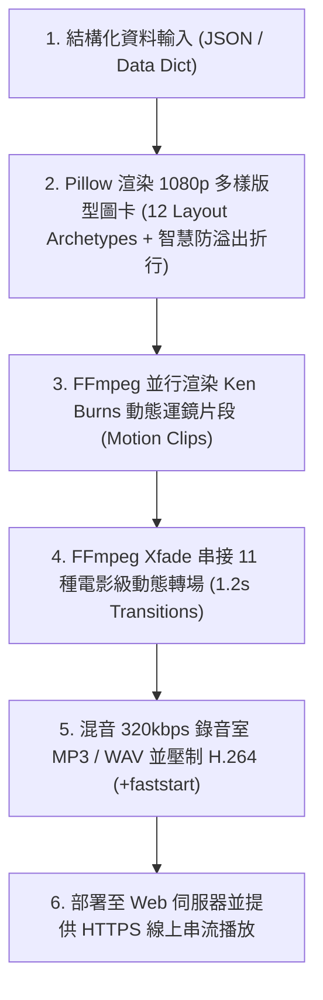

# 🎬 Universal Programmatic Video Generator Skill

本技能提供強大且通用的「純程式碼全自動影片生成管線」，能將任意主題的文字企劃、架構圖、業務報表、國家/產品介紹或科技專案，轉換為 **1080p Full HD 高畫質動態展示影片 (MP4)**。

---

## 🚀 核心架構與工作流程 (Pipeline Architecture)



---

## 🎨 一、 12 大通用視覺排版版型 (12 Layout Archetypes)

本引擎內建 12 種經典視覺版型，可適配任何通用主題，避免投影片視覺單調：

| 版型代碼 (`layout`) | 版型名稱 | 適用場景與特色 |
| :--- | :--- | :--- |
| `hero_poster` | **巨幅海報置中版** | 開場/首頁、品牌主視覺、3 大亮點指標卡片 |
| `split_2col` | **左右二分雙欄版** | 核心數據對比（左側 90%+ 巨幅數據 + 右側條列說明） |
| `dashboard_racks` | **機房/系統儀表板** | 頂部 KPI 雙方塊 + 底部 3 欄深色硬體/模組機櫃卡片 |
| `pyramid_peak` | **金字塔頂峰排版** | 頂尖旗艦標杆、中央高聳峰頂卡 + 兩側對稱基礎卡 |
| `vertical_columns` | **立柱長條多欄版** | 3~4 條垂直挺立的長條卡片，適合四大支柱、四大地標 |
| `timeline_track` | **橫向時間軸/路線** | 金色長軸節點，適合里程碑、發展路線、旅遊路線 |
| `asymmetric_showcase` | **主次不對稱展示** | 左側 55% 寬屏主卡 + 右側雙層疊加小卡 |
| `quadrant_grid` | **四象限/九宮格版** | 2×2 網格卡片，適合 4 大產品、美食小吃、矩陣分析 |
| `radial_ring` | **核心環繞交融版** | 中央圓形印章徽章 + 四個角落環繞特色卡片 |
| `circle_stats` | **圓形指標與寬卡** | 左側大圓形數字進度 + 右側雙寬屏基礎建設卡 |
| `quote_testimonial` | **溫暖名言故事版** | 巨幅毛玻璃名言卡片 + 3 顆愛心/信任評比徽章 |
| `portal_cta` | **宏觀世界之門結尾** | 放射光芒背景 + 3 根未來支柱 + 醒目行動按鈕 (CTA) |

---

## 📏 二、 智慧文字防溢出約束規範 (Intelligent Text Wrapping & Auto-Fit)

為徹底杜絕文字超出卡片方框（Overflow），所有文字繪製必須遵守以下原則：
1. **中英文雙向智慧折行（`wrap_text`）**：
   - 繪製前必須依照卡片寬度扣除 20px 安全內距（Padding），自動計算換行。
2. **動態字級自適應遞減（`draw_fitted_text`）**：
   - 當文字內容行數較多時，演算法會由預設字級向下遞減測試（例如 `24px ➔ 22px ➔ 20px ➔ 18px`），直到文字高度能完全收納於方框中。
3. **零溢出保證（Zero-Overflow Assurance）**：
   - 任何卡片內文均使用 `draw_fitted_text(draw, text, [x1, y1, x2, y2])` 邊界約束渲染，嚴禁使用無邊界約束的單行 `draw.text()`。

---

## 🎥 三、 電影級 Ken Burns 動態運鏡 (Dynamic Camera Motions)

每頁產生獨立的平滑攝影機運鏡，告別死板靜態圖：
- **`zoom_in_center`**：平滑推進 1.0x ➔ 1.14x，聚焦畫面核心。
- **`zoom_in_up`**：向上仰角推移，呈現高聳雄偉氣勢。
- **`zoom_in_left` / `zoom_in_right`**：橫向平移運鏡，展現寬廣視野。

---

## 🎭 四、 11 種電影級 Xfade 動態轉場 (Cinematic Xfade Transitions)

在多頁切換時，自動循環套用 11 種 1.2 秒平滑轉場效果：
1. `smoothleft` - 科技平滑向左推鏡
2. `slideup` - 畫面向上滑入
3. `fadeblack` - 沉浸黑幕漸隱升起
4. `smoothright` - 鏡頭平滑向右橫移
5. `circleopen` - 圓形光圈向外擴散
6. `slidedown` - 瀑布般向下俯衝
7. `dissolve` - 像素微光柔和溶解
8. `radial` - 時鐘指針式旋轉展開
9. `horzopen` - 百葉快門向兩側拉開
10. `fade` - 溫暖柔和跨頁交融
11. `fadewhite` - 璀璨白光閃耀展開

---

## 🎹 五、 音訊管線 (Audio Pipeline)

- 支援直接載入 **320kbps 錄音室真實 MP3 原聲演奏**（例如古典鋼琴、民謠吉他、自然輕音樂）。
- 自動結尾平滑淡出（`afade=t=out`）。
- 內建演算法音訊合成作為離線備援（Pure Python Polyphonic Synthesizer）。

---

## 💻 六、 快速調用與通用 JSON 配置範例

### 1. 通用 CLI 執行指令
```bash
python3 .agents/skills/programmatic-video-generator/scripts/generate_video.py \
  --config slides.json \
  --audio bgm.mp3 \
  --output showcase.mp4 \
  --slide-duration 10.0 \
  --transition-duration 1.2 \
  --fps 25
```

### 2. 通用 `slides.json` 結構範例
```json
[
  {
    "layout": "hero_poster",
    "badge": "🚀 產品發表會",
    "title": "新世代智能平台 2026",
    "subtitle": "引領數位轉型與智慧運算革命",
    "accent_color": "#38bdf8",
    "cards": [
      {"title": "極致效能", "desc": "運算吞吐量提升 10 倍", "color": "#38bdf8"},
      {"title": "企業級安全", "desc": "零信任端到端防護", "color": "#10b981"},
      {"title": "綠色節能", "desc": "直接液冷節省 40% 能耗", "color": "#fbbf24"}
    ],
    "footer": "通用展示模組 • 專業版"
  },
  {
    "layout": "split_2col",
    "badge": "📊 關鍵績效",
    "title": "全球運算領先地位",
    "subtitle": "無懈可擊的可靠度與全球分佈式架構",
    "accent_color": "#38bdf8",
    "highlight": {"tag": "SLA 保證", "metric": "99.99%", "label": "全球可用率", "desc": "覆蓋五大洲"},
    "cards": [
      {"title": "全球邊緣節點", "desc": "超過 300+ 邊緣資料中心", "color": "#38bdf8"},
      {"title": "極低延遲連線", "desc": "毫秒級直接對等互聯", "color": "#10b981"},
      {"title": "後量子加密", "desc": "全面升級抗量子演算法", "color": "#f59e0b"}
    ]
  }
]
```
