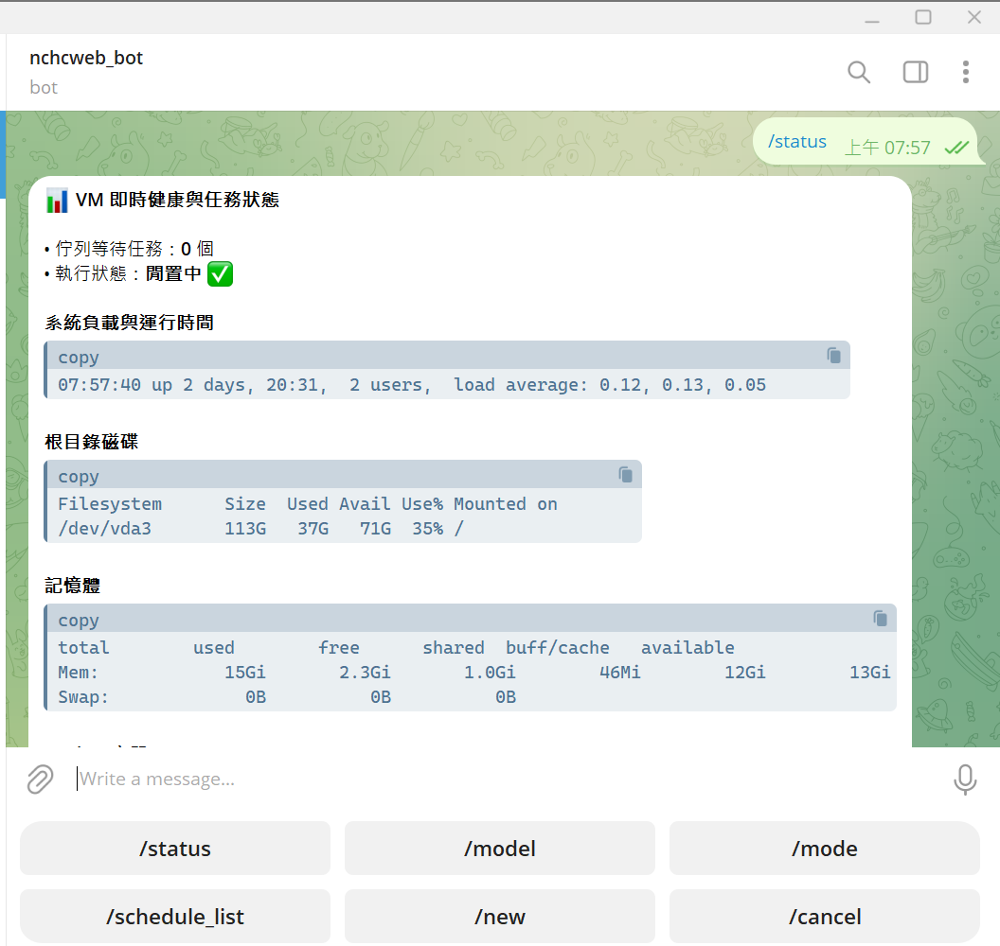

*English | [繁體中文](README.zh-TW.md)*

# HostSpark

[](LICENSE)
[](https://www.python.org/)



**HostSpark** is a 24/7 autonomous AI agent system built for Linux/Ubuntu hosts. It bridges Telegram and the Antigravity CLI (`agy`) to turn a host into a personal engineer and ops assistant you can control from your phone. Officially targeted at Taiwan's national research network (TWNIC), Chunghwa Telecom's cloud, other major cloud VPS providers, and any server running a regular Ubuntu user with systemd.

This project is not another AI agent framework, and it does not implement its own model, reasoning engine, or computer-control tools. Telegram provides the mobile messaging interface; this bot is only responsible for authorization, request forwarding, live streaming output, session isolation, scheduled triggers, timeouts, error handling, and message formatting. The actual AI reasoning, tool calls, file operations, and system control are all provided by AGY.

```text
Telegram (mobile / desktop)
   ↓
HostSpark Bot (auth / per-chat state / queue control / live streaming updates / scheduler)
   ↓ (no-shell subprocess calls, environment isolation, secret scrubbing)
AGY CLI (model reasoning / tool calls / context management / sessions)
   ↓
Ubuntu VM (filesystem / Docker containers / system services / hardware resources)
```

> [!WARNING]
> This is a remote VM management tool, not a general-purpose chatbot. Full mode auto-approves every tool operation AGY requests; if your Telegram account or Bot Token is compromised, the VM can be compromised too. Read [SECURITY.md](SECURITY.md) first.

## ✨ Key Features

- **Multi-user & chat allowlist authorization**: supports `ALLOWED_USER_IDS` and `ALLOWED_CHAT_IDS`, plus a `TELEGRAM_PRIVATE_ONLY` switch to restrict the bot to private chats.
- **Independent per-chat state**: each chat/user has its own Model, Effort, Mode, Sandbox, Verbose, and Workspace settings that never interfere with each other.
- **Live stream feedback**: reports thinking/tool-execution progress in real time, with a configurable end-of-run display mode (`full` / `compact` / `delete`).
- **Conversation session management**: `/new [name]` picks or creates a named project directory (confined under `AGY_WORKSPACE_ROOT`) as the chat's working directory and starts a fresh session; `/clear` resets just the conversation. Chats that never use `/new` keep their own dedicated, anonymous AGY working directory so conversations never bleed into each other.
- **Multimodal attachments & file interaction**: upload images or documents (`.py`, `.log`, `.pdf`, `.json`, etc.) directly for AGY to analyze; images and reports AGY produces are sent back automatically via Telegram.
- **Real-time quota & usage lookups**: `/usage` / `/quota` / `/credits` provide structured progress indicators (🟢/🟡/🔴/⭐/⚪ visual tags with pace-vs-time-elapsed analysis); `/context` shows context usage details.
- **Secure CLI passthrough with two-phase confirmation**: `/agy [ARGS]` supports native CLI flags (interactive `-i` deadlocks are hard-blocked; dangerous commands trigger a confirmation step automatically).
- **Host-level scheduler**: SQLite-backed persistence, standard 5-field cron, runtime variable templates, and an auto-circuit-breaker after 3 consecutive failures; execution results and circuit-breaker warnings are broadcast to **every** authorized admin (all of them, if you configure multiple `ALLOWED_USER_IDS`).
- **Job queue with auto-interrupt merging**: a single global serialized queue; sending a follow-up message while a task is running automatically merges it into the active task as `[Update / Follow-up]` instead of queuing separately.
- **Instance lock & crash auto-recovery**: a single-instance lock (with stale-lock takeover) plus automatic recovery of interrupted tasks after a bot restart.
- **Daily automatic cleanup**: the scheduler loop routinely purges `uploads/`, per-chat, and per-schedule working-directory files older than 30 days, so long-running 24/7 operation doesn't fill up disk.
- **Secret scrubbing & sandboxing**: subprocesses automatically strip the Telegram Token, the User ID allowlist, AWS keys, SSH private keys, and JWTs from their environment.

---

## ⚙️ Configuration (.env)

Create the config file:

```bash
cp .env.example .env
chmod 600 .env
nano .env
```

### Core settings:

```dotenv
# Telegram Bot API token (required, get it from @BotFather)
TELEGRAM_BOT_TOKEN=your_bot_token

# Telegram numeric User IDs authorized to operate the bot (required, comma-separated)
ALLOWED_USER_IDS=123456789,987654321

# Required: safe follows AGY's own permission rules; full auto-approves every AGY tool operation
AGY_PERMISSION_MODE=safe
```

### Optional advanced settings:

```dotenv
# Allowed Chat/group IDs (leave blank for no restriction)
ALLOWED_CHAT_IDS=

# Restrict to private chats only (1=yes, 0=no, default 1)
TELEGRAM_PRIVATE_ONLY=1

# Path to the agy executable (leave blank to auto-search PATH and ~/.local/bin/agy)
AGY_BIN=

# AGY working directory (leave blank to use the user's home directory)
AGY_WORKDIR=

# Comma-separated list of models allowed for switching. If left blank, falls back to a
# built-in default list -- but that list isn't guaranteed to match what your agy
# account can actually use. Run `agy models` on the VM first to get the real list,
# then paste it in here. Base names without a -high/-medium/-low suffix (e.g.
# gemini-3.8-flash) are recombined with AGY_EFFORT / the /effort picker into the
# real --model value agy expects; suffixed names are used as-is.
AGY_ALLOWED_MODELS="gemini-3.8-flash,gemini-3.7-flash,gemini-3.6-flash"

# Default reasoning effort for new conversations (low|medium|high, default high)
AGY_EFFORT=medium

# Real-time streaming progress verbosity (detailed=full multi-line thinking, compact=single line summary, silent=off, default detailed)
AGY_VERBOSE=detailed

# Finished status card behavior on task completion (compact=shows checkmark, delete=removes thinking card, full=keeps elapsed time and logs, default compact)
AGY_PROGRESS_MODE=compact

# Automatically interrupt and merge the previous task's prompt when a new message arrives (default 1)
AGY_AUTO_INTERRUPT=1

# Allow self-update via Telegram /restart and /update (default 0)
# Read "About /restart and /update" further down in this section before enabling this.
ALLOW_BOT_UPDATE=0

# Timezone used for scheduled tasks
AGY_SCHEDULE_TIMEZONE=Asia/Taipei

# Everything below is optional; leave blank to use the default:
# AGY_RULE_PROMPT=          # Custom behavior rules prepended to every AGY call (supports backgrounding rules for nohup, etc.)
# AGY_BOT_NAME="HostSpark"  # The name the bot refers to itself as
# AGY_WAITING_MESSAGE=      # The "please wait" message shown while a task runs
# AGY_WORKSPACE_ROOT=       # Root directory for attachment storage and path containment; defaults to AGY_WORKDIR. Also the parent directory /new's project-directory picker/creator is confined to
# AGY_DEFAULT_PROJECT_DIR=initial  # Name of the project directory pre-created under AGY_WORKSPACE_ROOT so /new's picker isn't empty on a fresh install
# AGY_CONVERSATION_DB_PATH= # Reserved for a future feature; no command reads it currently
# AGY_TIMEOUT_SECONDS=600         # Per-run AGY timeout in seconds (10-3600)
# AGY_MAX_OUTPUT_BYTES=1000000    # Max bytes retained for each of stdout/stderr
# AGY_SCHEDULE_DB_PATH=           # Path to the scheduler's SQLite database
# AGY_STATE_DB_PATH=              # Path to the per-chat state SQLite database
# AGY_SCHEDULE_MIN_INTERVAL_MINUTES=15  # Minimum interval between schedule runs (minutes)
# AGY_SCHEDULE_MAX_TASKS=20             # Maximum number of stored schedules
```

---

## 📖 Telegram Command Reference

### 1. Basics & status
| Command | Description |
|---|---|
| `/start` or `/help` | Show a welcome message, current permission status, and a full feature tour |
| `/menu` | Open the persistent quick-action keyboard in a 3-3-2 layout (covering system monitoring, model tuning, workspace, and task controls) |
| `/status` | View live VM load, disk, memory, Docker, and job queue status |
| `/cancel` | Cancel this chat's active or queued task |

> [!TIP]
> **Persistent Quick-Action Keyboard (3-3-2 Layout)**
> Type `/menu` anytime to bring up the balanced bottom keyboard:
> ```text
> [ /status ]        [ /model ]   [ /effort ]   ← Host monitoring & model tuning
> [ /session ]       [ /new ]     [ /clear ]    ← Project workspace & conversation resets
> [  /schedule_list  ]    [   /cancel   ]       ← Scheduled tasks & emergency cancel
> ```

> [!TIP]
> **Background Services & Web App Deployment (Zero-blocking Rule)**
> The repository bundles the recommended skill `web-service-deployer` in [`skills/web-service-deployer/`](skills/web-service-deployer/SKILL.md) (automatically installed to `~/.gemini/config/skills/` during `./install.sh`). When asking the AI to start web apps (e.g. Vite, React, Flask, FastAPI) or preview remotely on mobile, the AI proactively offers **Nohup lightweight development** vs **Docker containerization** deployment options, and automatically connects **Cloudflare Quick Tunnel** for secure public access without blocking the terminal session.

### 2. Conversation & sessions
| Command | Description |
|---|---|
| `/new [name]` | Pick or create a named project directory under `AGY_WORKSPACE_ROOT` as this chat's working directory (no name: pops up an interactive picker); automatically mounts it as an Active Workspace via `--add-dir` and starts a brand-new conversation |
| `/clear` | Reset the conversation session only, keeping the current project directory; the next message starts a brand-new session (suppresses `--continue`) |
| `/continue on\|off` | Toggle automatic conversation continuation (`--continue`) |
| `/session` | View all of this chat's current settings (active project directory, Model, Effort, Mode, Sandbox, etc.) |
| `/learn [text]` | Turn conversation experience and techniques into a reusable skill |
| `/compact` | Compact the current conversation context while preserving key decisions and state |

### 3. Model & execution preferences
| Command | Description |
|---|---|
| `/model [name]` or `/models` | View the available model list or switch the current model |
| `/effort low\|medium\|high` | Set reasoning effort |
| `/mode plan\|accept-edits` | Switch execution mode (`accept-edits` requires global Full mode) |
| `/sandbox on\|off` | Toggle terminal sandbox restrictions |
| `/verbose detailed\|compact\|silent` | Set real-time streaming progress verbosity (detailed: expand multi-line thinking, compact: single line summary, silent: off) |
| `/setdefault` | After confirmation, write this chat's settings back to `.env` as the new global default |

### 4. Quota, context & CLI passthrough
| Command | Description |
|---|---|
| `/usage` / `/quota` / `/credits` | Check AGY's remaining quota, usage pace, and reset time |
| `/context` | View context usage, categorized token breakdown, and checkpoint info |
| `/agy [ARGS...]` | Run a native `agy` CLI command directly (dangerous commands trigger a confirmation) |
| `/agy_confirm [TOKEN]` | Confirm and run a previously flagged, potentially risky agy command |
| `/agents`, `/changelog`, `/plugins`, `/version`, `/cli_help` | Read-only lookups of AGY's built-in info |
| `/agent [name]`, `/project [ID]`, `/add_dir [path]` | Set this chat's dedicated agent, project, or extra directory |
| `/output_format text\|json\|stream-json` | Set the output format used when this chat calls AGY |
| `/json_schema <SCHEMA>\|clear` | Set or clear `--json-schema` |
| `/log_file <PATH>\|clear` | Set or clear `--log-file` |
| `/print_timeout <DURATION>\|clear` | Set or clear `--print-timeout` (e.g. `5m`, `600s`) |
| `/new_project on\|off` | Toggle `--new-project` |
| `/disable_slash_commands on\|off` | Toggle `--disable-slash-commands` |

### 5. Scheduled task management
| Command | Description |
|---|---|
| `/schedule_help` | View cron syntax, variable templates, and rules for scheduled tasks |
| `/schedule_add <cron> <task>` | Create a scheduled task (AGY rewrites the prompt, then a preview confirmation pops up) |
| `/schedule_list` | List all scheduled tasks and their next run time |
| `/schedule_show <ID>` | View a schedule's full prompt template and run statistics |
| `/schedule_pause <ID>` | Pause a schedule |
| `/schedule_resume <ID>` | Resume a schedule |
| `/schedule_delete <ID>` | Delete a schedule |

> [!TIP]
> If you mention "schedule this", "remind me", or "every N minutes/hours" in a plain-text message, the bot intercepts it and walks you straight into the `/schedule_add` creation flow (AGY rewrites the prompt, then a Telegram button confirmation) instead of sending it to AGY as a normal turn — because if AGY treated that kind of request as an ordinary conversation, it might try to literally wait until that time in a single call, tying up the global job queue the whole time. If your message just happened to mention a time and you weren't actually asking for a schedule, just tap "❌ Cancel" on the confirmation prompt.

### 6. Ops: remote restart & update
| Command | Description |
|---|---|
| `/restart` | Restart the bot service |
| `/update` | Run `git pull origin main` in the repo directory, then restart automatically on success |

Both are **disabled** by default; set `ALLOW_BOT_UPDATE=1` in `.env` to enable them.

> [!NOTE]
> `install.sh` installs the service as a system-level systemd unit running as a regular user, and that user typically has **no permission** to call `systemctl restart` on its own service directly (it gets rejected by polkit with `Interactive authentication required`). So `/restart`/`/update` first try `systemctl restart`; if that fails, they exit with a **non-zero status code** instead — the systemd unit has `Restart=on-failure` configured, so it automatically brings the service back up within seconds. This means you don't need to grant extra sudo access or configure polkit rules for `/restart`/`/update` to work correctly; the service will just be briefly offline for about 5 seconds during the restart.

### Telegram command auto-complete (optional)

Send `/setcommands` to `@BotFather`, pick your bot, and paste the list below — typing `/` in Telegram will then pop up an auto-complete menu with descriptions (this is a curated subset of commonly used commands, not the full list):

```text
menu - Open the quick-action keyboard (3-3-2 layout)
status - View host resource status and the job queue
session - View current conversation settings and project directory
new - Switch or create project directory and start a fresh session
clear - Reset conversation session (keeps project directory)
model - View or switch the current AI model
effort - Set reasoning effort (low/medium/high)
mode - Set execution mode (plan/accept-edits)
sandbox - Toggle sandbox isolation (on/off)
verbose - Set streaming progress verbosity (detailed/compact/silent)
setdefault - Write the current settings back as the global default
usage - Check AGY quota and usage metrics
quota - Check remaining quota and reset time
context - View context and token usage details
cancel - Cancel the active or queued task
agy - Run native AGY CLI arguments
schedule_list - List all scheduled tasks
schedule_add - Add a new scheduled task
schedule_help - View scheduled-task cron syntax and help
help - Show the full feature guide
```

---

## 🚀 Quick Install & Upgrade

> Having an AI agent (Claude, etc.) perform this install on your behalf? Point it at [INSTALL_BY_AI.md](INSTALL_BY_AI.md) instead of this section.

```bash
git clone https://github.com/gemini960114/HostSpark.git
cd HostSpark
cp .env.example .env
chmod 600 .env
nano .env
chmod +x install.sh
./install.sh
```

### Verify the configuration and run tests:

```bash
venv/bin/python bot.py --check-config
venv/bin/python -m unittest discover -s tests -v
```

### Upgrading from an older version

Older versions only supported a single `ALLOWED_USER_ID`, had no per-chat settings, and lacked most of the commands described in this document. Before upgrading:

1. `sudo systemctl stop agy-telegram.service`, then back up your existing `.env` (`cp -p .env .env.bak`).
2. `git pull`, then fill in any new variables by comparing against `.env.example`. The old `ALLOWED_USER_ID` is auto-compatible, so you don't have to switch to `ALLOWED_USER_IDS` immediately — but it's recommended so you can add more users later.
3. Re-run `./install.sh` to resync dependencies and the systemd unit (it uses the new `requirements.lock`, which adds `pexpect`, `httpx`, and others).
4. After startup, run `/start` and `/status` to confirm the basics work, then try out whichever new commands you plan to use.

### If your Bot Token may have leaked

Immediately regenerate the token via `/token` with `@BotFather` (the old token is invalidated instantly), update `.env`, then `sudo systemctl restart agy-telegram.service`. Never paste the token into an issue, chat log, or terminal screenshot — treat it as compromised the moment it's exposed, even if you delete the message afterward, and rotate it.

---

## 🔒 Security & Privacy Notes

- **No shell invocation**: every subprocess call goes through `create_subprocess_exec` directly — never shell string concatenation.
- **Path traversal defense**: attachment uploads and `/add_dir` are always validated with `safe_join` and confined to the workspace.
- **SSRF defense**: AGY output-media resolution performs DNS resolution and private/reserved IP validation to block internal network probing and DNS rebinding.
- **Credential scrubbing**: logs and Telegram output automatically filter out Bot Tokens, AWS keys, SSH private keys, and JWTs.

See [SECURITY.md](SECURITY.md) for more details.

## 📄 License

This project is licensed under the [MIT License](LICENSE).
